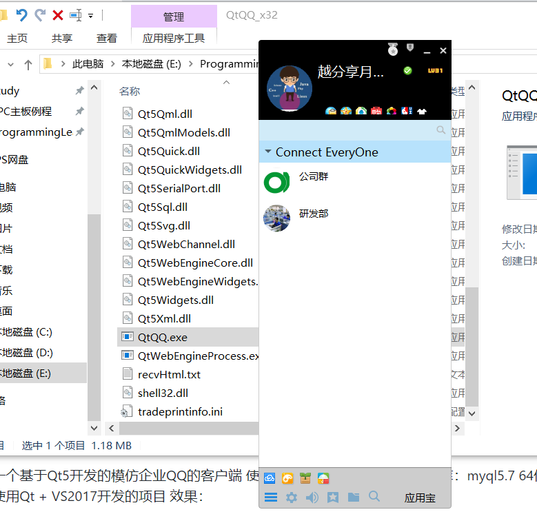
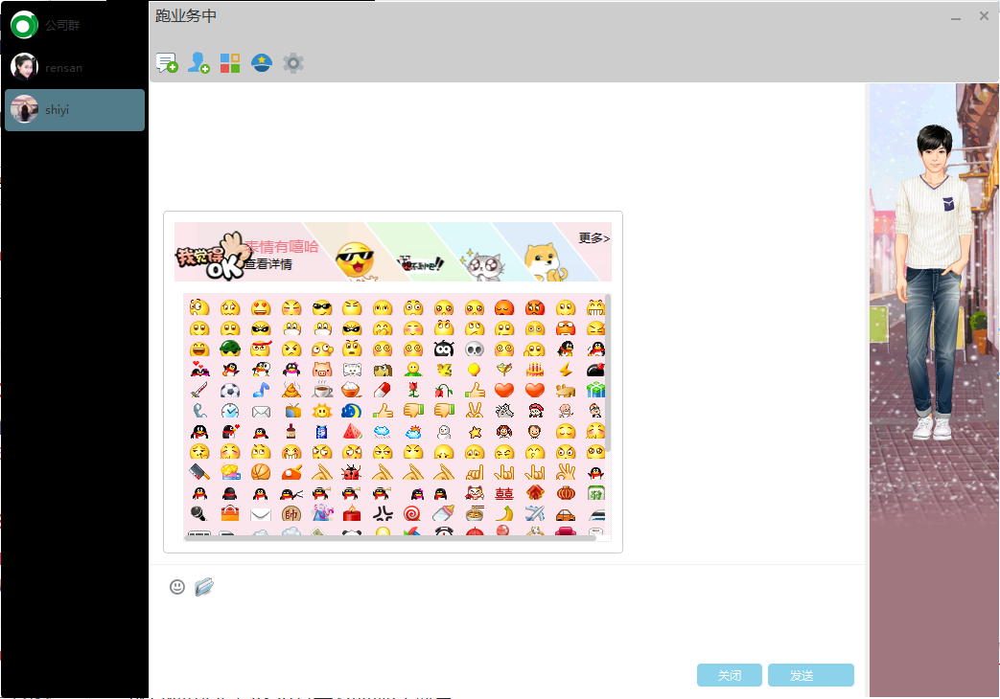
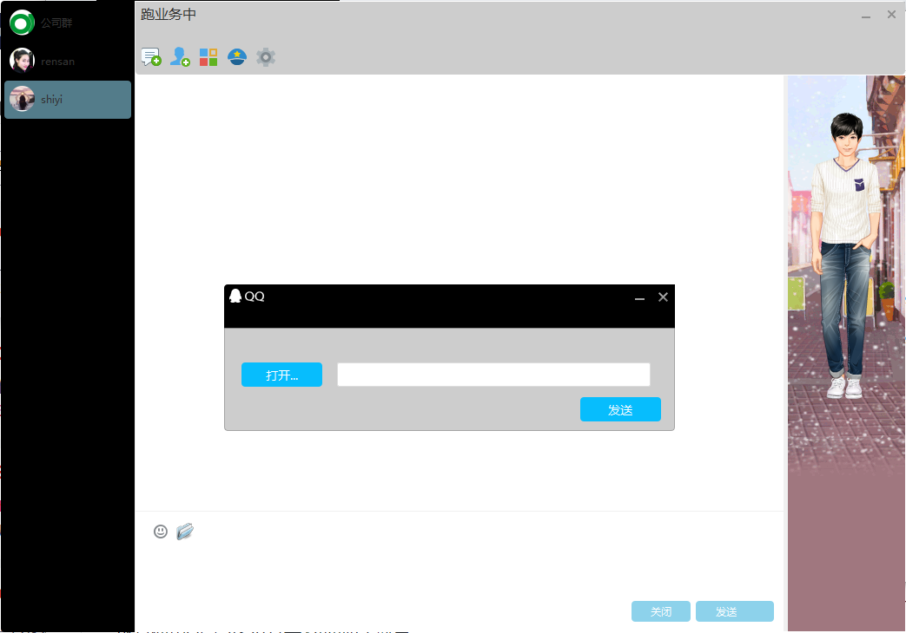
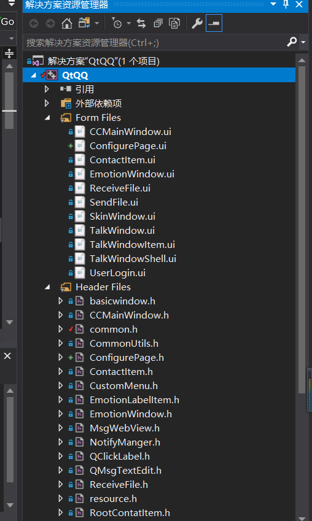
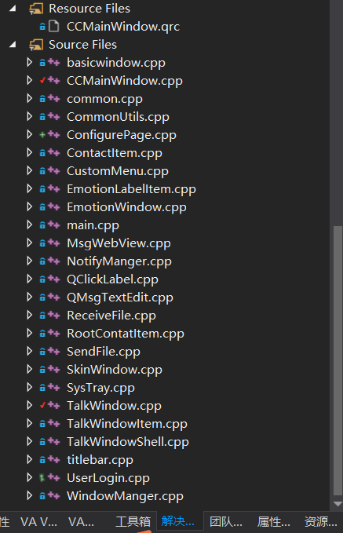

# QtQQ

**这是一个基于Qt5开发的模仿企业QQ的客户端**

## 1.运行平台环境

| 运行环境 | windows 系列系统 x86_x64 |
| -------- | ------------------------ |
| 库依赖   | Qt5.14.1                 |
| 开发工具 | VS2017                   |
| 数据库   | myql5.7 64位             |

## 2.界面效果：

**登录**

**主界面**

**会话窗口**

**聊天表情包**

**文件传输**

## 3.代码架构

|                       |                       |
| --------------------- | --------------------- |
|  |  |

